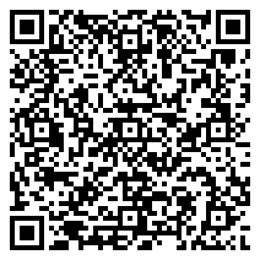

# SmarTelcom — License Rules

**Status:** Private · Apache-style · **Author Authorization required**  
**Author:** Roberto de Souza · **Email:** <rabbittrix@hotmail.com>  
**Project:** SmarTelcom

---

## 1. Binding rules

1. SmarTelcom is **private software**. It is **not** MIT and is **not** a public Apache-2.0 open-source grant.
2. **No use, copy, modify, distribute, deploy, or commercialize** without **written Authorization** from the Author.
3. Evaluation of the repository for deciding whether to request a license does **not** grant production or redistribution rights.
4. Payment (when required) must be completed **before** Authorization is considered active, unless the Author waives the fee in writing.
5. Keep `LICENSE`, this file, and copyright notices intact in any authorized copy.
6. Do not remove or obscure the payment / authorization section of these rules.
7. Third-party dependencies retain their own licenses (see `package-lock.json` / Cargo crates); this file governs **SmarTelcom original code and branding only**.

---

## 2. How to obtain Authorization

1. Email **<rabbittrix@hotmail.com>** with subject: `SmarTelcom License Authorization Request`
2. Include: full name / company, intended use, environment (lab / production), and seats or sites.
3. Complete the bank transfer (scan the QR below or use the IBAN details).
4. Send the transfer proof (reference + amount + date) in the same thread.
5. Wait for the Author’s written Authorization confirmation.

---

## 3. Bank transfer (authorization fee)

| Field | Value |
|---|---|
| **Beneficiary** | Roberto de Souza |
| **IBAN** | `PT50 3560 0001 9001 8573 6595 0` |
| **BIC / SWIFT** | `REVOPTP2` |
| **Currency** | EUR |
| **Reference** | `SmarTelcom License — <Your Name/Company>` |

### SEPA payment QR code

Scan with your banking app (EPC QR / SEPA Credit Transfer):

> Amount is left blank in the QR so the Author can confirm the fee for your Authorization scope. Use the transfer **reference** above so the payment can be matched.

---

## 4. Prohibited without Authorization

- Production network deployment or operator use  
- Redistribution, sublicensing, or SaaS wrapping  
- Removing license notices or claiming ownership  
- Training published models on proprietary SmarTelcom sources for commercial products without Authorization  

---

## 5. Contact

**Roberto de Souza**  
Email: [rabbittrix@hotmail.com](mailto:rabbittrix@hotmail.com)

Related documents: [`../LICENSE`](../LICENSE) · [`../README.md`](../README.md)
